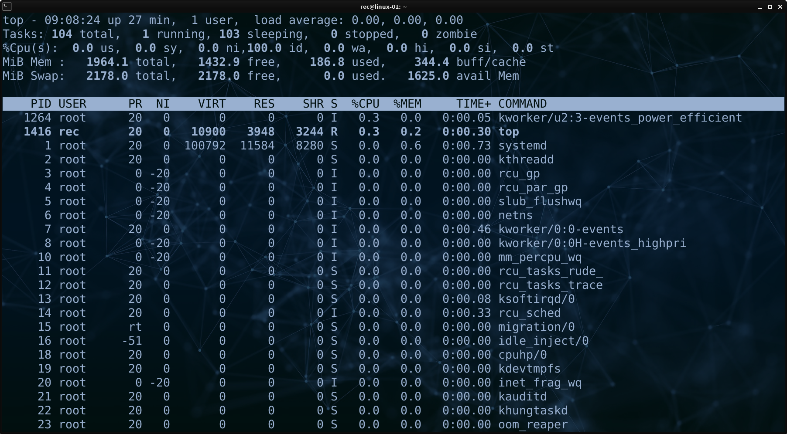
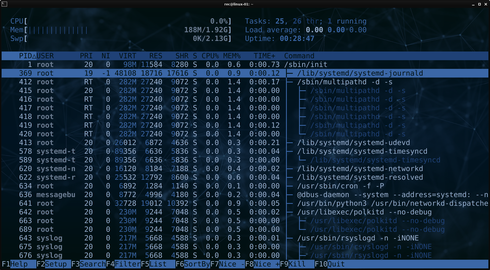

# Prozessverwaltung: Prozesse auflisten und stoppen

Für die Verwaltung von Prozessen auf einem Linux-System, sind folgende Befehle nützlich:

* **`ps` - Auflisten von Prozessen:**
  
  - Der Befehl **`ps`** wird verwendet, um eine Liste der laufenden Prozesse auf dem System anzuzeigen.
  - Die gängige Option **`aux`** ermöglicht die detaillierte Anzeige von Informationen zu jedem Prozess:
    - **`a` - Prozess aller Benutzer anzeigen:**
      - Mit der Option "a" werden Prozesse aller Benutzer aufgelistet, nicht nur die des ausführenden Benutzers.
    - **`u` - Ausführliche Informationen anzeigen:**
      - Die Option "u" zeigt ausführliche Informationen für jeden Prozess an.
    - **`x` - Prozesse ohne Terminal anzeigen:**
      - Die Option "x" bewirkt, dass auch Prozesse ohne zugehöriges Terminal angezeigt werden. 
        Dies umfasst z.B. Hintergrundprozesse, die nicht direkt mit einer Benutzersitzung verbunden sind.
  
* **`top` - Laufende Prozesse anzeigen und analysieren:**
  - Zeigt standardmäßig laufende Prozesse nach CPU-Auslastung sortiert an.
  - Beendigung des **"top"**-Befehls erfolgt durch Drücken der Taste **"Q"**.
  - Prozesse können durch Drücken der Taste **"K"** und Anwendung des Befehls "kill" beendet werden.

  
  
* **`htop` - Alternative zu Top mit erweitertem Funktionsumfang:**
  
  - Eine umfangreichere Alternative zu **`top`**, die in vielen Linux-Distributionen separat installiert werden muss.
  - Interaktiv bedienbar, im unteren Bereich werden Hinweise zur Verwendung angezeigt.
  
  
  
* **`kill` - Prozesse beenden:**
  
  - Durch **`kill <prozess-id>`** wird ein Prozess geordnet beendet.
  - Die **erzwungene** Beendigung eines Prozesses erfolgt mit **`kill -9 <prozess-id>`**.
  
* **`killall` - Prozesse anhand des Namens beenden:**
  
  - **`killall <prozess-name>`** beendet alle Prozesse mit dem angegeben Namen geordnet.
  - **`killall -9 <prozess-id>`** führt zu einem **erzwungenen** Abbruch des Prozesses.