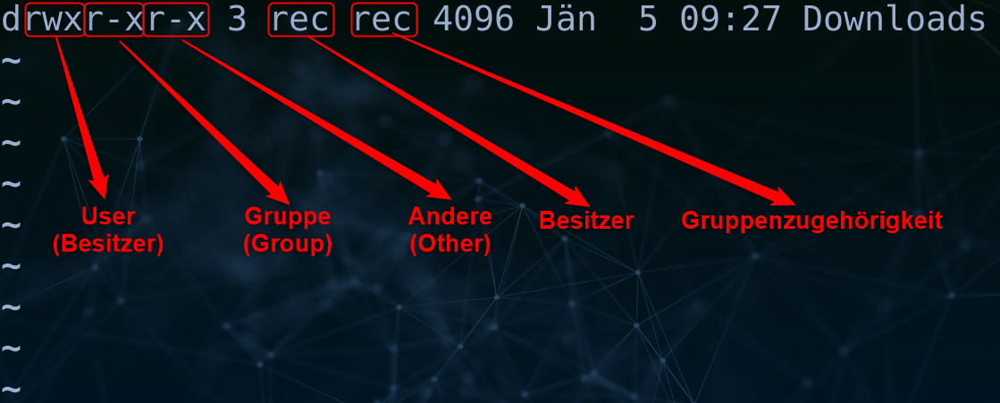

# Zugriffsrechte unter Linux: Grundlagen

Auf dieser Seite sind die Grundlagen bezüglich der Zugriffsrechte unter Linux zusammengefasst und essenzielle Kommandos in diesem Zusammenhang erklärt.

## Auflistung und Bedeutung

* **Zugriffsrechte auflisten:**

  - Mit dem Befehl `ls -l` können die Zugriffsrechte einer Datei oder eines Verzeichnisses angezeigt werden. Ein Beispiel-Screenshot:

    

- **Zugriffsrechte:**

  | Recht | Bedeutung für Datei                  | Bedeutung für Verzeichnis                                    |
  | ----- | ------------------------------------ | ------------------------------------------------------------ |
  | `r`   | Erlaubt das Lesen einer Datei.       | Erlaubt das Lesen/Durchsuchen des Verzeichnisses.            |
  | `w`   | Erlaubt das Schreiben in eine Datei. | Erlaubt Änderungen in einem Verzeichnis (Dateien/Unterverzeichnisse erstellen, löschen, umbenennen). |
  | `x`   | Erlaubt die Ausführung einer Datei.  | Erlaubt das Wechseln (`cd`) in ein Verzeichnis.              |

- **Nutzergruppen:**
  
  - **`user` (Besitzer):** Rechte, die dem Besitzer einer Datei oder eines Verzeichnisses gewährt werden.
  - **`group` (Gruppe):** Rechte, die Mitgliedern der Gruppe zugeordnet sind.
  - **`other` (Andere):** Rechte, die für alle Benutzer gelten, unabhängig von der Zugehörigkeit zu Besitzer oder Gruppe.
  
- **Numerische Werte:**
  
  | Recht | Bedeutung                      | Numerischer Wert |
  | ----- | ------------------------------ | ---------------- |
  | ---   | Kein Zugriff                   | 0                |
  | r     | Lesen                          | 4                |
  | w     | Schreiben                      | 2                |
  | x     | Ausführen                      | 1                |
  | rw-   | Lesen und Schreiben            | 6                |
  | r-x   | Lesen und Ausführen            | 5                |
  | -wx   | Schreiben und Ausführen        | 3                |
  | rwx   | Lesen, Schreiben und Ausführen | 7                |

## Änderung der Zugriffsrechte 

- **chmod-Kommando:**
  - Ermöglicht das Ändern der Zugriffsrechte von Dateien und Verzeichnissen.
  - **Numerische Änderung:**
    - **`chmod 644 datei`** 
      - Besitzer: Lesen und Schreiben
      - Gruppe: Lesen
      - Andere: Lesen
  - **Änderung mittels Operatoren (+,- und =):**
    - **`chmod +x datei`:** Fügt Ausführungsrechte für alle Benutzer hinzu.
    - **`chmod g-w datei`:** Entzieht der Gruppe Schreibrechte für die Datei.
    - **`chmod o=rwx datei`:** Setzt Ausführungsrechte für andere Benutzer auf Lesen, Schreiben und Ausführen.
- **chown-Kommando:**
  - Kann den Besitzer und die Gruppenzugehörigkeit von Dateien und Verzeichnissen ändern. 
  - Root-Rechte sind erforderlich, um den Besitzer zu ändern.
  - **Beispiel (Besitzer und Gruppe ändern):** `sudo chown user:group datei` - Ändert sowohl den Benutzer als auch die Gruppe der Datei.
- **chgrp-Kommando:**
  - Ändert die Gruppenzugehörigkeit von Dateien und Verzeichnissen.
  - **Beispiel (Gruppe ändern):** `chgrp group datei`