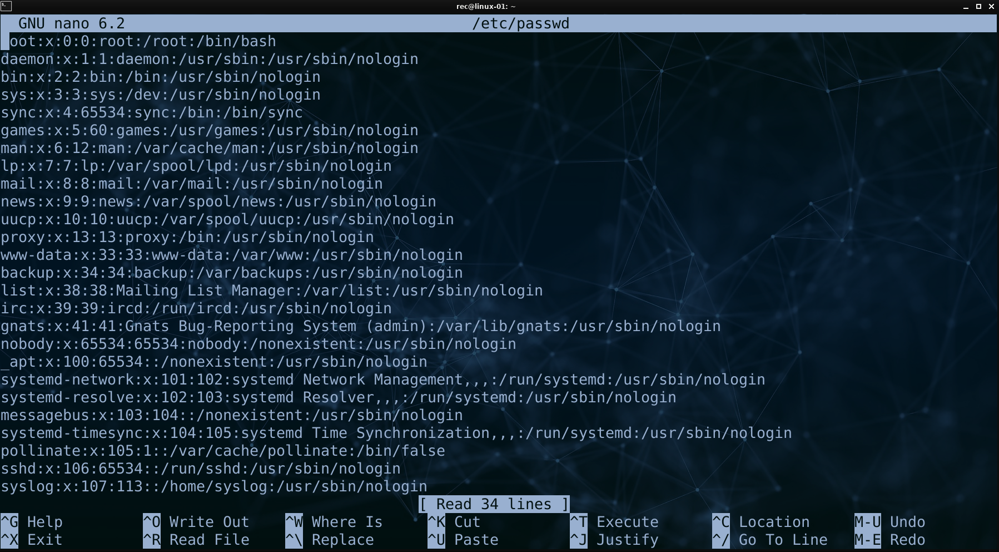

# Texteditoren

## nano

Der Editor **"nano"** ist ein **einfach zu bedienender** Editor zum Bearbeiten von Dateien innerhalb der Konsole.
Aufgrund der einfachen Bedienbarkeit wird der Editor gerne für **kurze, schnelle Bearbeitungen** oder auch von **Einsteigern** verwendet.

Das Editieren einer Datei kann wie folgt gestartet werden:
```bash
nano <dateiname>
```

Die wichtigsten Tastenkürzel zur Bedienung werden direkt im unteren Bereich des Editors angezeigt:


Dabei entspricht das Hochzeichen (**^**) dem Drücken der **STRG-Taste** bzw. der **control-Taste** (macOS).
Beispiel: **^X** -> **STRG + X** bzw. **control + X** 

Eine erweiterte Übersicht über die einzelnen Tastenkombinationen findet sich auf der Webseite von "nano": 
https://www.nano-editor.org/dist/latest/cheatsheet.html

## vi

Der Editor **"vi"** ist ein leistungsstarker Texteditor, der auf vielen Unix-ähnlichen Betriebssystemen verfügbar ist. 
"Vi" ist bekannt für seine Vielseitigkeit und Leistungsfähigkeit, wird jedoch oft als weniger intuitiv für Einsteiger angesehen.
Im Gegensatz zu vielen anderen Editoren, existieren innerhalb von "vi" verschiedene Modi.

Das Editieren einer Datei mittels "vi" kann wie folgt gestartet werden:

```bash
vi <dateiname>
```

Unter vielen Linux-Distributionen wird hierdurch der mit "vi" kompatible Editor "vim" gestartet.

Mit dem Kommando `vimtutor` kann ein interaktives Tutorial gestartet werden.

### Insert-Modus

**Aktivierung des Modus:**
Durch Drücken von `i` im Command-Modus (aktiv nach starten von "vi") wechselt man z.B. in den Insert-Modus.

**Texteingabe:**
Im Insert-Modus ist die direkte Eingabe von Text möglich.

**Wechsel zum Command-Modus:**
Zum Verlassen des Insert-Modus und Wechseln zum Command-Modus wird `ESC` verwendet.

### Command-Modus:

**Aktivierung des Modus:**
Durch Drücken von `ESC` im Insert-Modus wird der Command-Modus erreicht.

**Textbearbeitung:**
Löschen: Das Zeichen unter dem Cursor wird durch `x` entfernt.
Zeilen löschen: Mit `dd` wird die gesamte Zeile gelöscht.

### Extended Command-Modus (Ex-Modus) in vi:

**Aktivierung des Modus:**
Der Extended Command-Modus wird durch Drücken von `:` im Command-Modus erreicht.

**Dateiverwaltung:**
Öffnen: `:e dateiname` öffnet die angegebene Datei.
Speichern und Verlassen: Mit `:wq` werden die Änderungen gespeichert und der Editor verlassen.
Verlassen ohne Speichern: `:q!` beendet "vi", ohne zu speichern.

